# Introduction

host = http://test.botv.io:88

# AUTH

- **/api/manager/auth**

## POST **/login**

**Headers**

| Parameter    | Description      |
| ------------ | ---------------- |
| Content-Type | application/json |

> BODY EXEMPLE

```json
{
  "email": "admin",
  "password": "admin"
}
```

## GET **/logout**

- Clear Auth Cookie

  **Headers**

| Parameter    | Description      |
| ------------ | ---------------- |
| Content-Type | application/json |

## POST **/recover**

- Send an email to reset password

  **Headers**

| Parameter    | Description      |
| ------------ | ---------------- |
| Content-Type | application/json |

> BODY EXEMPLE

```json
{ "email": "haica@haica.com" }
```

## POST **/change** and **/change-password**

- Clear Auth Cookie

  **Headers**

| Parameter    | Description      |
| ------------ | ---------------- |
| Content-Type | application/json |

## POST **/register**

**Headers**

| Parameter    | Description      |
| ------------ | ---------------- |
| Content-Type | application/json |

> BODY EXEMPLE

```json
{
  "_id": "5ef4a84ad2625330f4e4a56a",
  "lName": "LNAME",
  "fName": "FNAME",
  "phone": "90888888",
  "company": "VneuronInc",
  "password": "pASSWORD",
  "cPassword": "pASSWORD"
}
```

# NEWS

- **/api/manager/news**

## ENUMS

| Parameter  | Description                                                                                                                          |
| ---------- | ------------------------------------------------------------------------------------------------------------------------------------ |
| Priority   | FAIBLE : 0, MOYENNE : 1, IMPORTANTE : 2                                                                                              |
| Impact     | FAIBLE : 0, MOYENNE : 1, IMPORTANTE : 2                                                                                              |
| Status     | EN ATTENTE DAFFECTATION : 0, EN ATTENTE DE VÉRIFICATION : 1, EN ATTENTE DE VALIDATION : 2, VALIDÉ : 3, PUBLIÉ : 4, NON APPROUVÉE : 5 |
| Infraction | NO INFRACTION: 0, INFRACTION A VALIDER: 1,INFRACTION VALIDE: 2                                                                       |

## Filters Explanation

- Filters

| Parameter | Description                                                                                       |
| --------- | ------------------------------------------------------------------------------------------------- |
| after     | greater or equal than (Exp : "after_created" : "1592265600000" creation date greater than 16/06)  |
| before    | smaller or equal than (Exp : "before_created" : "1592265600000" creation date smaller than 16/06) |
| multi     | multi search (Exp : "multi_priority": [0, 2] get news where priority is equal to 0 or 2)          |
| all       | all search (Exp : "all_text": "Hello" get news where text contains "Hello")                       |
| equal     | (Exp : "equal_text": "Hello" get news where text is equal to "Hello")                             |
| like      | (Exp : "like_text": "Hello" get news where text is like "Hello")                                  |
| regexp    | search by regex expression (Exp : "regex_projectId": ".+" search where projectId != "" )          |

- Sort :

| Parameter | Description |
| --------- | ----------- |
| asc       | asending    |
| desc      | descending  |

## GET **/assigned**

- Get all news assigned to the authenticated user

**Headers**

| Parameter    | Description           |
| ------------ | --------------------- |
| Content-Type | application/json      |
| Cookie       | MUST BE AUTHENTICATED |

## GET **/added**

- Get all news added by the authenticated user

**Headers**

| Parameter    | Description           |
| ------------ | --------------------- |
| Content-Type | application/json      |
| Cookie       | MUST BE AUTHENTICATED |

## GET **/all**

- Get all fakenews

**Headers**

| Parameter    | Description           |
| ------------ | --------------------- |
| Content-Type | application/json      |
| Cookie       | MUST BE AUTHENTICATED |

## GET **/projects**

- Get all news from all projects

**Headers**

| Parameter    | Description           |
| ------------ | --------------------- |
| Content-Type | application/json      |
| Cookie       | MUST BE AUTHENTICATED |

## GET **/projects/:projectId**

- Get all news from a specific project

**Headers**

| Parameter    | Description           |
| ------------ | --------------------- |
| Content-Type | application/json      |
| Cookie       | MUST BE AUTHENTICATED |

**URL Parameters**

| Parameter | Description |
| --------- | ----------- |
| ProjectId | id          |

## GET **/:newsId**

- Get a specific news

**Headers**

| Parameter    | Description           |
| ------------ | --------------------- |
| Content-Type | application/json      |
| Cookie       | MUST BE AUTHENTICATED |

**URL Parameters**

| Parameter | Description |
| --------- | ----------- |
| newsId    | id          |

## GET **/required-actions**

- Get all todo actions of the authenticated user

**Headers**

| Parameter    | Description           |
| ------------ | --------------------- |
| Content-Type | application/json      |
| Cookie       | MUST BE AUTHENTICATED |

## GET **/description**

- Get all News Keys used in sorting

**Headers**

| Parameter    | Description           |
| ------------ | --------------------- |
| Content-Type | application/json      |
| Cookie       | MUST BE AUTHENTICATED |

## GET **/:newsId/changes**

- Get a specific news history of changes

**Headers**

| Parameter    | Description           |
| ------------ | --------------------- |
| Content-Type | application/json      |
| Cookie       | MUST BE AUTHENTICATED |

**URL Parameters**

| Parameter | Description |
| --------- | ----------- |
| newsId    | id          |

## POST **/projects/search?page=0&size=10&append=false**

- Search For Articles in a Project

**Headers**

| Parameter    | Description           |
| ------------ | --------------------- |
| Content-Type | application/json      |
| Cookie       | MUST BE AUTHENTICATED |

**URL Parameters**

| Parameter | Description   |
| --------- | ------------- |
| Page      | number (OPT)  |
| Size      | number (OPT)  |
| Append    | boolean (OPT) |

> BODY EXEMPLE

```json
{
  "filter": {
    "all_text": "TEXT_TO_SEARCH",
    "multi_priority": [0, 2],
    "musonlti_impact": [0, 2],
    "after_created": "0", //Date
    "before_created": 1590969600000, //Date
    "multi_subjects": ["5e4c06639758c11d3c97c836", "5ede63f42e99fef702f60aec"], //SUBJECTS IDs
    "multi_categories": [
      "5ebd0f99ed3bd46e736d8ebd",
      "5ede640cc72b43c9a4aa5865"
    ], //CATEGORIES IDs
    "multi_status": [0, 1]
  },
  "moreLike": {
    "like": "WORD",
    "fields": ["title"], // title,text ....
    "max_query_terms": 30,
    "min_word_length": 4,
    "min_term_freq": "5",
    "min_doc_freq": 1
  },
  "sort": [
    { "key": "categories.keyword", "order": "asc" },
    { "key": "additionalLinks.keyword", "order": "desc" }
  ]
}
```

## POST **/all/search?page=0&size=10&append=false**

- Search For Articles in Fakenews

**Headers**

| Parameter    | Description           |
| ------------ | --------------------- |
| Content-Type | application/json      |
| Cookie       | MUST BE AUTHENTICATED |

> BODY EXEMPLE

```json
{
  "filter": {
    "all_text": "TEXT_TO_SEARCH",
    "multi_priority": [0, 2],
    "musonlti_impact": [0, 2],
    "after_created": "0", //Date
    "before_created": 1590969600000, //Date
    "multi_subjects": ["5e4c06639758c11d3c97c836", "5ede63f42e99fef702f60aec"], //SUBJECTS IDs
    "multi_categories": [
      "5ebd0f99ed3bd46e736d8ebd",
      "5ede640cc72b43c9a4aa5865"
    ], //CATEGORIES IDs
    "multi_status": [0, 1]
  },
  "moreLike": {
    "like": "WORD",
    "fields": ["title"], // title,text ....
    "max_query_terms": 30,
    "min_word_length": 4,
    "min_term_freq": "5",
    "min_doc_freq": 1
  },
  "sort": [
    { "key": "categories.keyword", "order": "asc" },
    { "key": "additionalLinks.keyword", "order": "desc" }
  ]
}
```

**URL Parameters**

| Parameter | Description   |
| --------- | ------------- |
| Page      | number (OPT)  |
| Size      | number (OPT)  |
| Append    | boolean (OPT) |

## POST **/added/search?page=0&size=10&append=false**

- Search For Articles added by the authenticated user

**Headers**

| Parameter    | Description           |
| ------------ | --------------------- |
| Content-Type | application/json      |
| Cookie       | MUST BE AUTHENTICATED |

> BODY EXEMPLE

```json
{
  "filter": {
    "all_text": "TEXT_TO_SEARCH",
    "multi_priority": [0, 2],
    "musonlti_impact": [0, 2],
    "after_created": "0", //Date
    "before_created": 1590969600000, //Date
    "multi_subjects": ["5e4c06639758c11d3c97c836", "5ede63f42e99fef702f60aec"], //SUBJECTS IDs
    "multi_categories": [
      "5ebd0f99ed3bd46e736d8ebd",
      "5ede640cc72b43c9a4aa5865"
    ], //CATEGORIES IDs
    "multi_status": [0, 1]
  },
  "moreLike": {
    "like": "WORD",
    "fields": ["title"], // title,text ....
    "max_query_terms": 30,
    "min_word_length": 4,
    "min_term_freq": "5",
    "min_doc_freq": 1
  },
  "sort": [
    { "key": "categories.keyword", "order": "asc" },
    { "key": "additionalLinks.keyword", "order": "desc" }
  ]
}
```

**URL Parameters**

| Parameter | Description   |
| --------- | ------------- |
| Page      | number (OPT)  |
| Size      | number (OPT)  |
| Append    | boolean (OPT) |

## POST **/assigned/search?page=0&size=10&append=false**

- Search For Articles assigned by the authenticated user

**Headers**

| Parameter    | Description           |
| ------------ | --------------------- |
| Content-Type | application/json      |
| Cookie       | MUST BE AUTHENTICATED |

> BODY EXEMPLE

```json
{
  "filter": {
    "all_text": "TEXT_TO_SEARCH",
    "multi_priority": [0, 2],
    "musonlti_impact": [0, 2],
    "after_created": "0", //Date
    "before_created": 1590969600000, //Date
    "multi_subjects": ["5e4c06639758c11d3c97c836", "5ede63f42e99fef702f60aec"], //SUBJECTS IDs
    "multi_categories": [
      "5ebd0f99ed3bd46e736d8ebd",
      "5ede640cc72b43c9a4aa5865"
    ], //CATEGORIES IDs
    "multi_status": [0, 1]
  },
  "moreLike": {
    "like": "WORD",
    "fields": ["title"], // title,text ....
    "max_query_terms": 30,
    "min_word_length": 4,
    "min_term_freq": "5",
    "min_doc_freq": 1
  },
  "sort": [
    { "key": "categories.keyword", "order": "asc" },
    { "key": "additionalLinks.keyword", "order": "desc" }
  ]
}
```

**URL Parameters**

| Parameter | Description   |
| --------- | ------------- |
| Page      | number (OPT)  |
| Size      | number (OPT)  |
| Append    | boolean (OPT) |

## POST **/\*/search**

- Fix Filters Format passed to in the request body before continuing to searh

**Headers**

| Parameter    | Description           |
| ------------ | --------------------- |
| Content-Type | application/json      |
| Cookie       | MUST BE AUTHENTICATED |

> BODY EXEMPLE

```json
{
  "filter": {}
}
```

## POST **/projects/count**

- Count Articles existing in Projects using Filter passed in the request body

**Headers**

| Parameter    | Description           |
| ------------ | --------------------- |
| Content-Type | application/json      |
| Cookie       | MUST BE AUTHENTICATED |

> BODY EXEMPLE

```json
{ "filter": {} }
```

### POST **/all/count**

- Count Fakenews using Filter passed in the request body

**Headers**

| Parameter    | Description           |
| ------------ | --------------------- |
| Content-Type | application/json      |
| Cookie       | MUST BE AUTHENTICATED |

> BODY EXEMPLE

```json
{
  "filter": {}
}
```

## DELETE **/:newsId**

- Delete a specific news

**Headers**

| Parameter    | Description           |
| ------------ | --------------------- |
| Content-Type | application/json      |
| Cookie       | MUST BE AUTHENTICATED |

**URL Parameters**

| Parameter | Description |
| --------- | ----------- |
| newsId    | id          |

## PUT **/:newsId**

- Update a specific news

**Headers**

| Parameter    | Description           |
| ------------ | --------------------- |
| Content-Type | application/json      |
| Cookie       | MUST BE AUTHENTICATED |

> BODY EXEMPLE

```json
{
  "id": "5ee25fe0e64c7a381fdca40e",
  "title": "newest",
  "link": "https://www.linkedin.com/in/jawher-hamza/",
  "newsType": 0,
  "subjects": ["5ede63f42e99fef702f60aec", "5e4c06639758c11d3c97c836"],
  "categories": ["5ede640cc72b43c9a4aa5865"],
  "reliability": 0,
  "additionalLinks": ["https://www.linkedin.com/in/jawher-hamza/"],
  "videoUrl": "https://www.linkedin.com/in/jawher-hamza/",
  "text": "DESC",
  "userCoverImage": [],
  "infraction": {
    "status": 0,
    "infractionType": "",
    "comment": "",
    "link": "",
    "files": [],
    "responsible": "",
    "confirmComment": ""
  },
  "communication": { "decision": 0, "text": "", "links": [] },
  "impact": 0,
  "priority": 0,
  "monitor": "5d55e3f00000000000000da5",
  "lastModified": 1591895370648,
  "created": 1591893984933,
  "creator": "5d55e3f00000000000000da5",
  "creatorInfo": {
    "lName": "Admin",
    "fName": "Default",
    "id": "5d55e3f00000000000000da5"
  },
  "status": 1,
  "files": [
    {
      "serverId": "36972d7b05d9a07b56367736b85d0d11",
      "filename": "HAICA SPECS.pdf",
      "fileType": "application/pdf",
      "fileSize": 1012402
    }
  ],
  "originalArticle": "",
  "projectId": "",
  "formInfos": [],
  "media": "",
  "actionPlan": [],
  "comments": [],
  "videoTrackComments": [],
  "score": 1,
  "coverImage": "",
  "dueDate": "2020-07-21T12:00:00+01:00"
}
```

**URL Parameters**

| Parameter | Description |
| --------- | ----------- |
| newsId    | id          |

## POST **/**

- Update a specific news

**Headers**

| Parameter    | Description           |
| ------------ | --------------------- |
| Content-Type | application/json      |
| Cookie       | MUST BE AUTHENTICATED |

> BODY EXEMPLE

```json
{
  "title": "LFC13",
  "link": "http://192.168.1.230/reusable-components/NLP/BotStudio/blob/master/services/galand-manager/models/News.js",
  "subjects": ["5e4e43f5877c43481fbfacdd"],
  "categories": ["5ebd0f99ed3bd46e736d8ebd"],
  "reliability": 0,
  "files": [
    {
      "serverId": "98027636f501c35c1305daa95dcf9caf",
      "filename": "exemple Infraction.pdf",
      "fileType": "application/pdf",
      "fileSize": 1012973
    }
  ],
  "additionalLinks": [
    "http://192.168.1.230/reusable-components/NLP/BotStudio/blob/master/services/galand-manager/models/News.js"
  ],
  "videoUrl": "http://192.168.1.230/reusable-components/NLP/BotStudio/blob/master/services/galand-manager/models/News.js",
  "text": "DESC",
  "monitor": "5d55e3f00000000000000da5",
  "dueDate": "2020-07-13T12:00:00+01:00",
  "projectId": "5d55vcdegfzer0erg4er68" // in case adding to a project
}
```

**URL Parameters**

| Parameter | Description |
| --------- | ----------- |
| newsId    | id          |

# FEED

- **/api/manager/feed**

## ENUMS

| Enum     | Description                                                                                                              |
| -------- | ------------------------------------------------------------------------------------------------------------------------ |
| Priority | FAIBLE:0, MOYENNE:1, IMPORTANTE:2                                                                                        |
| Impact   | FAIBLE:0, MOYENNE:1, IMPORTANTE:2                                                                                        |
| Status   | EN ATTENTE DAFFECTATION:0, EN ATTENTE DE VÉRIFICATION:1, EN ATTENTE DE VALIDATION:2, VALIDÉ:3, PUBLIÉ:4, NON APPROUVÉE:5 |

## PS

| Prefix | Description                                                                                       |
| ------ | ------------------------------------------------------------------------------------------------- |
| after  | greater or equal than (Exp : "after_created" : "1592265600000" creation date greater than 16/06)  |
| before | smaller or equal than (Exp : "before_created" : "1592265600000" creation date smaller than 16/06) |
| multi  | multi search (Exp : "multi_priority": [0, 2] get news where priority is equal to 0 or 2)          |
| all    | all search (Exp : "all_text": "Hello" get news where text contains "Hello")                       |
| equal  | (Exp : "equal_text": "Hello" get news where text is equal to "Hello")                             |
| like   | (Exp : "like_text": "Hello" get news where text is like "Hello")                                  |
| regexp | search by regex expression (Exp : "regex_projectId": ".+" search where projectId != "" )          |

- Sort :

| Value | Description                                                      |
| ----- | ---------------------------------------------------------------- |
| asc   | asending EXP : "sort": [{ "key": "created", "order": "asc" }]    |
| desc  | descending EXP : "sort": [{ "key": "created", "order": "desc" }] |

### POST **/search?page=0&size=10&append=false**

- Search For Feeds

**Headers**

| Parameter    | Description           |
| ------------ | --------------------- |
| Content-Type | application/json      |
| Cookie       | MUST BE AUTHENTICATED |

**URL Parameters**

| Parameter | Description   |
| --------- | ------------- |
| Page      | number (OPT)  |
| Size      | number (OPT)  |
| Append    | boolean (OPT) |

> BODY EXEMPLE

```json
{
  "filter": {
    "multi_source": ["twitter", "instagram"],
    "multi_media": ["5ed4e5eef1442430af669c77"],
    "after_created": 1591743600000,
    "before_created": 1592953200000,
    "like_author": "LFC"
  },
  "sort": [{ "key": "source.keyword", "order": "asc" }]
}
```

## GET **/?page=0&size=10&append=false**

- Search For Feeds

**Headers**

| Parameter    | Description           |
| ------------ | --------------------- |
| Content-Type | application/json      |
| Cookie       | MUST BE AUTHENTICATED |

**URL Parameters**

| Parameter | Description   |
| --------- | ------------- |
| Page      | number (OPT)  |
| Size      | number (OPT)  |
| Append    | boolean (OPT) |

### GET **/description**

- Get all News Keys (used in sorting)

**Headers**

| Parameter    | Description           |
| ------------ | --------------------- |
| Content-Type | application/json      |
| Cookie       | MUST BE AUTHENTICATED |

## GET **/:feedId**

- Get a specific feed

**Headers**

| Parameter    | Description           |
| ------------ | --------------------- |
| Content-Type | application/json      |
| Cookie       | MUST BE AUTHENTICATED |

**URL Parameters**

| Parameter | Description |
| --------- | ----------- |
| feedId    | id          |

## GET **/display**

- Returns displays for each source (facebook, instagram ....)

**Headers**

| Parameter    | Description           |
| ------------ | --------------------- |
| Content-Type | application/json      |
| Cookie       | MUST BE AUTHENTICATED |

**URL Parameters**

| Parameter | Description |
| --------- | ----------- |
| feedId    | id          |

## PUT **\***

- Update a the feed passed in the request body

**Headers**

| Parameter    | Description           |
| ------------ | --------------------- |
| Content-Type | application/json      |
| Cookie       | MUST BE AUTHENTICATED |

> BODY EXEMPLE

```json
{
"scrore_projet_x": 17101,
"updatedTime": 1591753802730,
"like_count": 29048,
"author": "LFC",
"custom_dictionary": { "CUST_corona": 0 },
"created": 1588327200000,
"language": "en",
"media": "5ed4e5eef1442430af669c77",
"source": "twitter",
"title": "It was a really difficult end to 2019 for season ticket holder, David Kerruish, so @JHenderson decided it was time… https://t.co/p1pG1mUZte",
"score": 2,
"userId": 19583545,
"retweet_count": 5155,
"url": "https://twitter.com/user/status/1256161439598800898",
"urls": "https://t.co/p1pG1mUZte<br />",
"firstCrawlTime": 1591753802497,
"text": "It was a really difficult end to 2019 for season ticket holder, David Kerruish, so @JHenderson decided it was time… https://t.co/p1pG1mUZte",
"occurences": null,
"id": "02d44239a48ca39fd1d48b62b4a43f19",
"selectedFor": [
{
"newsId": "5ee9f30cb7cc52a2f0aafb3c",
"newsTitle": "It was a really difficult end to 2019 for season ticket holder, David Kerruish, so @JHenderson decided it was time… https://t.co/p1pG1mUZte",
"type": "monitoring",
"name": "LFC"
}
]
```

# DICTIONARY

- **/api/manager/dictionaries**

## POST **/**

- Add a Dictionary
- **Permission** needed (P_DICTIONNARY > 1)

**Headers**

| Parameter    | Description           |
| ------------ | --------------------- |
| Content-Type | application/json      |
| Cookie       | MUST BE AUTHENTICATED |

> BODY EXEMPLE

```json
{ "name": "Sports", "corpus": "ball foOtball basketball" }
```

## PUT **/:id**

- Update a Dictionary
- **Permission** needed (P_DICTIONNARY > 1)

**Headers**

| Parameter    | Description           |
| ------------ | --------------------- |
| Content-Type | application/json      |
| Cookie       | MUST BE AUTHENTICATED |

**URL Parameters**

| Parameter     | Description |
| ------------- | ----------- |
| Dictionary Id | id          |

> BODY EXEMPLE

```json
{
  "name": "Sports",
  "corpus": "ball fotball basketball tennis",
  "_id": "5eea12981d58b5065c5269a3"
}
```

## DELETE **/:id**

- Delete a Dictionary
- **Permission** needed (P_DICTIONNARY > 1)

**Headers**

| Parameter    | Description           |
| ------------ | --------------------- |
| Content-Type | application/json      |
| Cookie       | MUST BE AUTHENTICATED |

**URL Parameters**

| Parameter     | Description |
| ------------- | ----------- |
| Dictionary Id | id          |

# CUSTOM DICTIONARY

- **/api/manager/custom-dictionaries**

## POST **/**

- Add a Custom Dictionary
- **Permission** needed (P_DICTIONNARY > 1)

**Headers**

| Parameter    | Description           |
| ------------ | --------------------- |
| Content-Type | application/json      |
| Cookie       | MUST BE AUTHENTICATED |

> BODY EXEMPLE

```json
{
  "name": "Sports",
  "words": ["ball", "basketball", "football"]
}
```

## PUT **/:id**

- Update a Classification
- **Permission** needed (P_DICTIONNARY > 1)

**Headers**

| Parameter    | Description           |
| ------------ | --------------------- |
| Content-Type | application/json      |
| Cookie       | MUST BE AUTHENTICATED |

**URL Parameters**

| Parameter            | Description |
| -------------------- | ----------- |
| Custom Dictionary Id | id          |

> BODY EXEMPLE

```json
{
  "name": "Sports",
  "words": ["ball", "basketball", "football"],
  "_id": "5eea12981d58b5065c5269a3"
}
```

## DELETE **/:id**

- Delete a Custom Dictionary
- **Permission** needed (P_DICTIONNARY > 1)

**Headers**

| Parameter    | Description           |
| ------------ | --------------------- |
| Content-Type | application/json      |
| Cookie       | MUST BE AUTHENTICATED |

**URL Parameters**

| Parameter            | Description |
| -------------------- | ----------- |
| Custom Dictionary ID | id          |

# CLASSIFICATION

- **/api/manager/classification**

## ENUMS

| ClassificationEnum         | Value |
| -------------------------- | ----- |
| Classification Simple      | 0     |
| Multi Label Classification | 1     |
| Sequence Classification    | 2     |

## GET **/:id**

- Get a specific Classification
- **Permission** needed (P_CLASSIFICATION >= 1)

**Headers**

| Parameter    | Description           |
| ------------ | --------------------- |
| Content-Type | application/json      |
| Cookie       | MUST BE AUTHENTICATED |

**URL Parameters**

| Parameter         | Description |
| ----------------- | ----------- |
| Classification Id | id          |

## GET **/**

- Get All Classifications
- **Permission** needed (P_CLASSIFICATION >= 1)

**Headers**

| Parameter    | Description           |
| ------------ | --------------------- |
| Content-Type | application/json      |
| Cookie       | MUST BE AUTHENTICATED |

## PUT **/:id**

- Update Classification
- **Permission** needed (P_CLASSIFICATION > 1)

**Headers**

| Parameter    | Description           |
| ------------ | --------------------- |
| Content-Type | application/json      |
| Cookie       | MUST BE AUTHENTICATED |

**URL Parameters**

| Parameter         | Description |
| ----------------- | ----------- |
| Classification Id | id          |

> BODY EXEMPLE

```json
{
  "classificationType": "0",
  "created": 1590589515430,
  "lastModified": 1590589515430,
  "name": "CORONA",
  "trainingFiles": [],
  "\\_id": "5ece784bc81d3b057e14f51d"
}
```

## DELETE **/:id**

- Delete a Classification
- **Permission** needed (P_CLASSIFICATION > 1)

**Headers**

| Parameter    | Description           |
| ------------ | --------------------- |
| Content-Type | application/json      |
| Cookie       | MUST BE AUTHENTICATED |

**URL Parameters**

| Parameter         | Description |
| ----------------- | ----------- |
| Classification ID | id          |

## POST **/**

- Add a Classification
- **Permission** needed (P_CLASSIFICATION > 1)

**Headers**

| Parameter    | Description           |
| ------------ | --------------------- |
| Content-Type | application/json      |
| Cookie       | MUST BE AUTHENTICATED |

> BODY EXEMPLE

```json
{ "name": "Sports", "classificationType": "0", "trainingFiles": [] }
```

# PROJECTS

- **/api/manager/projects**

## GET **/**

- Get All Projects
- **Permission** needed (P_PROJECT >= 1)

**Headers**

| Parameter    | Description           |
| ------------ | --------------------- |
| Content-Type | application/json      |
| Cookie       | MUST BE AUTHENTICATED |

## PUT **/:id**

- Update Project
- **Permission** needed (P_PROJECT > 1)

**Headers**

| Parameter    | Description           |
| ------------ | --------------------- |
| Content-Type | application/json      |
| Cookie       | MUST BE AUTHENTICATED |

**URL Parameters**

| Parameter  | Description |
| ---------- | ----------- |
| Project ID | id          |

> BODY EXEMPLE

```json
{
  "_id": "5ed4e606c7fdf30f4edc406d",
  "title": "LFC",
  "theme": "TEST",
  "startProject": 1590966000000,
  "endProject": 1595372400000,
  "dictionaries": ["5eea12981d58b5065c5269a3"],
  "customDictionaries": ["5eea1367b3768509bbdeff60"],
  "customSearches": ["5ed4ea021a8be092c71cc7a9"],
  "models": ["5e665a0858ee2c71b5e56582"],
  "media": ["5ed4e5eef1442430af669c77", "5ede64af0bf97debf4b7032d"],
  "assignees": ["5d55e3f00000000000000da5"],
  "forms": []
}
```

## DELETE **/:id**

- Delete a Project
- **Permission** needed (P_PROJECT > 1)

**Headers**

| Parameter    | Description           |
| ------------ | --------------------- |
| Content-Type | application/json      |
| Cookie       | MUST BE AUTHENTICATED |

**URL Parameters**

| Parameter  | Description |
| ---------- | ----------- |
| Project ID | id          |

## POST **/**

- Add a Project
- **Permission** needed (P_PROJECT > 1)

**Headers**

| Parameter    | Description           |
| ------------ | --------------------- |
| Content-Type | application/json      |
| Cookie       | MUST BE AUTHENTICATED |

> BODY EXEMPLE

```json
{
  "title": "LFC",
  "theme": "TEST",
  "startProject": 1590966000000,
  "endProject": 1595372400000,
  "dictionaries": ["5eea12981d58b5065c5269a3"],
  "customDictionaries": ["5eea1367b3768509bbdeff60"],
  "customSearches": ["5ed4ea021a8be092c71cc7a9"],
  "models": ["5e665a0858ee2c71b5e56582"],
  "media": ["5ed4e5eef1442430af669c77", "5ede64af0bf97debf4b7032d"],
  "assignees": ["5d55e3f00000000000000da5"],
  "forms": []
}
```

# MEDIA

- **/api/manager/media**

## GET **/**

- Get All Medias
- **Permission** needed (P_MEDIA >= 1)

**Headers**

| Parameter    | Description           |
| ------------ | --------------------- |
| Content-Type | application/json      |
| Cookie       | MUST BE AUTHENTICATED |

## PUT **/:id**

- Update Media
- **Permission** needed (P_MEDIA > 1)

**Headers**

| Parameter    | Description           |
| ------------ | --------------------- |
| Content-Type | application/json      |
| Cookie       | MUST BE AUTHENTICATED |

**URL Parameters**

| Parameter  | Description |
| ---------- | ----------- |
| Project ID | id          |

> BODY EXEMPLE

```json
{
  "_id": "5ed4e5eef1442430af669c77",
  "name": "LFC",
  "links": [
    {
      "schedule": "0 */30 * * * ? *",
      "source": "instagram",
      "url": "https://www.instagram.com/liverpoolfc/?hl=fr"
    },
    {
      "schedule": "0 */30 * * * ? *",
      "source": "facebook",
      "url": "https://www.facebook.com/LiverpoolFC/"
    },
    {
      "schedule": "0 */30 * * * ? *",
      "source": "twitter",
      "url": "https://twitter.com/lfc"
    },
    {
      "schedule": "0 */1 * * * ? *",
      "source": "youtube",
      "url": "https://www.youtube.com/user/LiverpoolFC"
    }
  ],
  "type": "Médias"
}
```

## DELETE **/:id**

- Delete a Media
- **Permission** needed (P_MEDIA > 1)

**Headers**

| Parameter    | Description           |
| ------------ | --------------------- |
| Content-Type | application/json      |
| Cookie       | MUST BE AUTHENTICATED |

**URL Parameters**

| Parameter | Description |
| --------- | ----------- |
| Media ID  | id          |

## POST **/**

- Add a Media
- **Permission** needed (P_MEDIA > 1)

**Headers**

| Parameter    | Description           |
| ------------ | --------------------- |
| Content-Type | application/json      |
| Cookie       | MUST BE AUTHENTICATED |

> BODY EXEMPLE

```json
{
  "name": "Obama",
  "type": "Politician",
  "links": [
    {
      "url": "https://twitter.com/barackobama",
      "source": "twitter",
      "schedule": "0 0 00 */1 * ? *" //cron task
    }
  ]
}
```

# TAGS

- **/api/manager/tags**

## GET **/**

- Get All Tags (Subjects and Categories)
- **Permission** needed (P_TAGS >= 1)

**Headers**

| Parameter    | Description           |
| ------------ | --------------------- |
| Content-Type | application/json      |
| Cookie       | MUST BE AUTHENTICATED |

## PUT **/:id**

- Update a Tag
- **Permission** needed (P_TAGS > 1)

**Headers**

| Parameter    | Description           |
| ------------ | --------------------- |
| Content-Type | application/json      |
| Cookie       | MUST BE AUTHENTICATED |

**URL Parameters**

| Parameter | Description |
| --------- | ----------- |
| Tag ID    | id          |

> BODY EXEMPLE

```json
{
  "_id": "5ede63f42e99fef702f60aec",
  "label": "Football",
  "count": 42,
  "isCategory": false,
  "color": "#ffc0cb"
}
```

## DELETE **/:id**

- Delete a Tag
- **Permission** needed (P_TAGS > 1)

**Headers**

| Parameter    | Description           |
| ------------ | --------------------- |
| Content-Type | application/json      |
| Cookie       | MUST BE AUTHENTICATED |

**URL Parameters**

| Parameter | Description |
| --------- | ----------- |
| Tag ID    | id          |

## POST **/**

- Add a Tag
- **Permission** needed (P_TAGS > 1)

**Headers**

| Parameter    | Description           |
| ------------ | --------------------- |
| Content-Type | application/json      |
| Cookie       | MUST BE AUTHENTICATED |

> BODY EXEMPLE

```json
{
  "color": "#9b59b6",
  "label": "BlackLivesMatter",
  "isCategory": true //if it's a category
}
```

# CUSTOM SEARCH

- **/api/manager/custom-search**

## GET **/**

- Get All Custom Searches (Subjects and Categories)
- **Permission** needed (P_CUSTOM_SEARCH >= 1)

**Headers**

| Parameter    | Description           |
| ------------ | --------------------- |
| Content-Type | application/json      |
| Cookie       | MUST BE AUTHENTICATED |

## PUT **/:id**

- Update a CS
- **Permission** needed (P_CUSTOM_SEARCH > 1)

## **Headers**

title: Guide d'utilisation du plateforme de "Fact Checking"

toc_footers:

- <a href='https://github.com/slatedocs/slate'>Documentation Powered by Slate</a>

includes:

- errors

## search: true

# Introduction

Guide d'utilisation du plateforme du "fact checking"

# Forms

Permet d'analyser le contenu des articles.

## Création

<b>Path:</b> <a href="/forms">/forms</a>

<center>
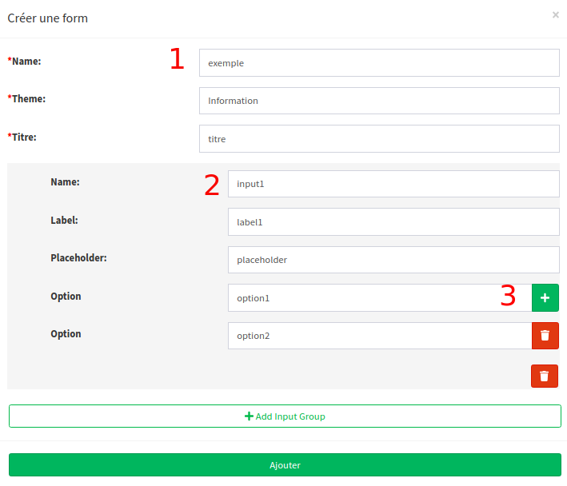
</center>

1. Le champ "Name" va être utilisé pour réferencer les valeurs au niveau du filtre avancé et au niveau du Kibana

2. Le champ "Name" de "Input Group" va être utilisé pour réferencer les valeurs au niveau du filtre avancé et au niveau du Kibana

3. Les options sont les valeurs possibles pour chaque "Input Group"

## Utilisation

### Association à un projet

On peut associer les "Forms" à un projet au niveau de l'interface du création du projet <span> 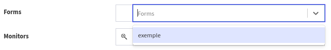 </span>

### Exploitation des formulaires

Les articles ajoutés à des projets ayant des "Forms" vont contenir une tab "Analytics" permettant de remplir les formulaires et sauvegarder les informations

<center>
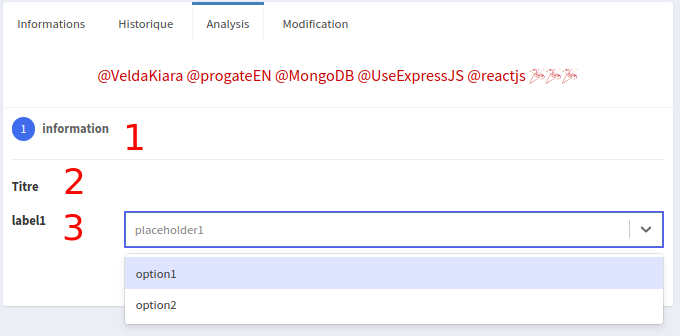
</center>

1. Les formulaires vont être regroupés par thème

2. Le titre du formulaire

3. Les "Input Group" ajoutés au formulaire

### Filtre & Recherche

Les Formulaires d'analyse permettent de filtrer les résultats au niveau du liste des articles

<center>
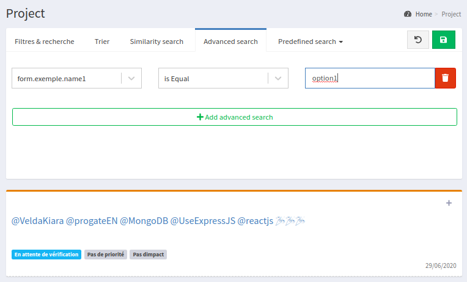
</center>

Les attribues sont crées de la format: <b>form</b>.<u>{Nom du formulaire}</u>.<u>{Nom du "Input Group"}</u>

Exemple : form.exemple.name1

# Video Reverse Search

Permet de faire Google Reverse Search sur des images extraits des vidéos

## Configuration

<center>
 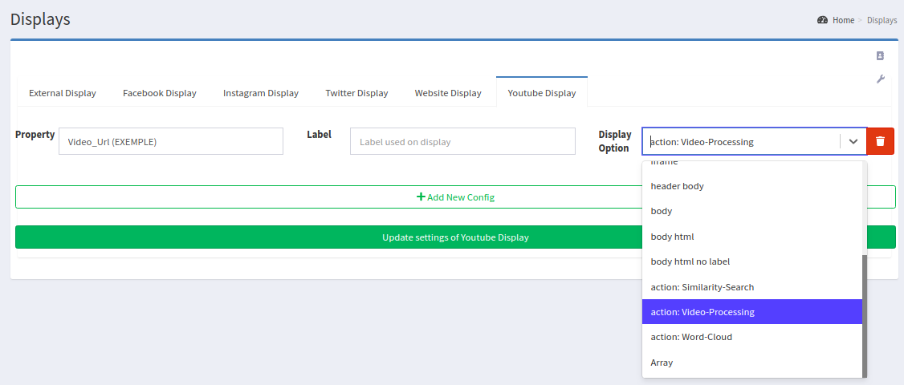
</center>

Au niveaux du "Paramètres d'affichage" <a href="/DisplaySettings"> /DisplaySettings </a>, ajouter le type d'affichage "Action: video-processing" au attribut correspond à un lien d'un vidéo.

<aside class="notice">
    Les types des liens vidéo supportés peuvent être trouvés avec ce <a href="https://ytdl-org.github.io/youtube-dl/supportedsites.html"> lien </a>

</aside>

## Sélectionner des vidéos pour être traités

Aprés la configuration, un Boutton va s'afficher au niveau d'un article contenant un vidéo <span>  </span>

<center>
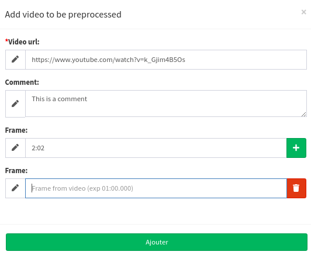
</center>

- On peut sélectionner les moments à extraire depuis le vidéo.
- Le temps du frame doit être sur le format <b>MINUTES:SECONDS.MILLISECONDS</b> ( exemple : 03:05.678 )

## Exploiter les résultats

<b>Path : </b> <a href="/videos-preprocessing" > /videos-preprocessing</a>

<center>
    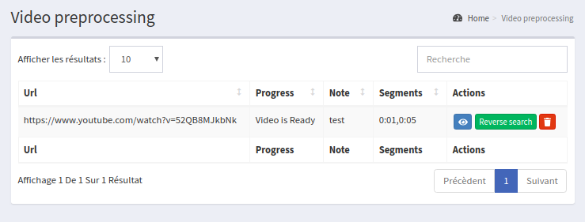
</center>

- Le vidéo va être téléchargé et segmenté.
- Après le traitement, le boutton "reverse search" va s'afficher et va permettre d'effectuer Google Image Search sur les segments sélectionnés

# Web Scrapping Rules

Au contraire du scrapping des réseaux sociaux, le scrapping web traite des donées semi-structuré.

Ce module va permettre de créer des différents régles pour le parsing des pages web.

# Videos

- **/api/manager/videos**

## POST **/**

- Add a Video
- **Permission** needed (P_MEDIA > 1)

**Headers**

| Parameter    | Description           |
| ------------ | --------------------- |
| Content-Type | application/json      |
| Cookie       | MUST BE AUTHENTICATED |

> BODY EXEMPLE

```json
{
  "name": "Sports",
  "words": ["ball", "basketball", "football"]
}
```

## PUT **/:id**

- Update a Classification
- **Permission** needed (P_MEDIA > 1)

**Headers**

| Parameter    | Description           |
| ------------ | --------------------- |
| Content-Type | application/json      |
| Cookie       | MUST BE AUTHENTICATED |

**URL Parameters**

| Parameter            | Description |
| -------------------- | ----------- |
| Custom Dictionary Id | id          |

> BODY EXEMPLE

```json
{
  "name": "Sports",
  "words": ["ball", "basketball", "football"],
  "_id": "5eea12981d58b5065c5269a3"
}
```

## DELETE **/:id**

- Delete a Custom Dictionary
- **Permission** needed (P_MEDIA > 1)

**Headers**

| Parameter    | Description           |
| ------------ | --------------------- |
| Content-Type | application/json      |
| Cookie       | MUST BE AUTHENTICATED |

**URL Parameters**

| Parameter            | Description |
| -------------------- | ----------- |
| Custom Dictionary ID | id          |

---

<center>
    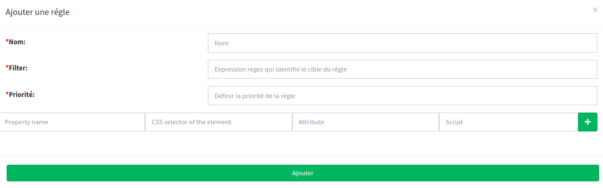
</center>

- <b>Nom: <b> pour le but de documentation
- <b>Filtre: <b> expression regex permettant d'identifier la page cible suivant l'url
- <b>Priorité: <b> permettant de résoudre le conflit entre diffèrent filtre qui cible le même url (Celui ayant la priorité la plus haute va être appliquer)

* <b>Property Name :<b> Nom du champs créer
* <b>CSS selector :<b> <a href="https://www.w3schools.com/cssref/css_selectors.asp"> CSS selector </a> permettant d'identifier l'élément HTML en question
* <b> Attribute </b> Nom de l'attribue de l'élement html contenant la valeur (exemple : src, href, value ...). Par défaut, il va extraire le text de l'élément HTML

### Script

- Le language de programmation des scripts est <a href="https://www.elastic.co/guide/en/elasticsearch/painless/current/index.html"> Elastic Search Painless Script</a>

- <b>params.value</b> est une référence à la valeur extrait par la combinaison du CSS Selector et Attribute

- <b>params.\_source</b> est une référence à l'object retourné par la requéte HTML
- Il faut définir une valeur par défaut pour chaque propriété
- Il est possible de modifier l'expression des propriétés à tout moments
- Il n'est pas possible de modifier le type des propriétés
- Les propriétés, une fois créé, vont exister pour toujours même si on supprime les scripts
- Il y a une limite de 1000 propriétés
- Il est conseillé d'utiliser les mêmes nomenclatures pour les propriétés de différent réseaux sociaux

# Classification

<center>
    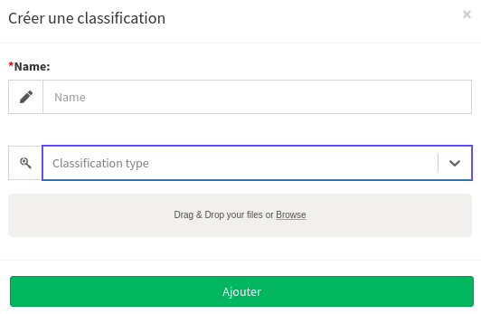
</center>

- <b> Name :</b> Nom pour documentation
- <b> Classification Type :</b>
  - Simple Classification ( Multiclass Classification ): chaque input a une seule Class <a href="./assets/simple_classification.csv" download> fichier d'exemple </a>
  - Multi-label Classification: chaque input a une ou plusieurs Class <a href="./assets/multilabel_classification.csv" download> fichier d'exemple </a>
  - Sequence Classification: chaque input a un nombre fixe des Classes <a href="./assets/sequence_classification.csv" download> fichier d'exemple </a>

<aside class="info">
    Seulement les fichiers CSV sont acceptés
</aside>

# Settings

## Parsers

<center>
    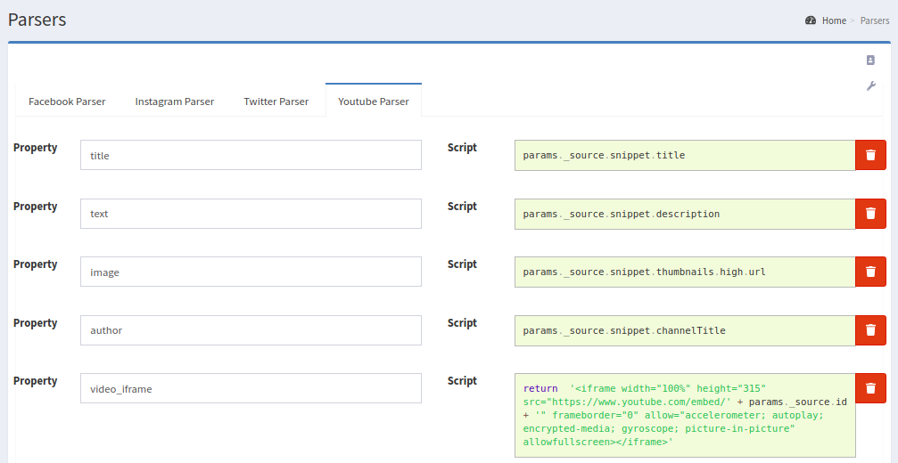
</center>

- Chaque type de réseaux sociaux contient ses propres scriptes de parsing
- Le champ "Property" définie le nom de propriété qui va être créer
- Le champ "Script" définie le script à exécuter

### Script

- Le language de programmation des scripts est <a href="https://www.elastic.co/guide/en/elasticsearch/painless/current/index.html"> Elastic Search Painless Script</a>
- <b>params.\_source</b> est une référence à l'object retourné par l'Api des réseaux sociaux
- Il faut définir une valeur par défaut pour chaque propriété
- Il est possible de modifier l'expression des propriétés à tout moments
- Il n'est pas possible de modifier le type des propriétés
- Les propriétés, une fois créé, vont exister pour toujours même si on supprime les scripts
- Il y a une limite de 1000 propriétés
- Il est conseillé d'utiliser les mêmes nomenclatures pour les propriétés de différent réseaux sociaux

<aside class="danger">
    Pour définir une propriété avec une valeur liste, le Script doit retourner une liste avec une dimension additionnelle
    <br />

    exemple: pour creér une propriété avec la valeur = [1,2,3]
    <br />
    > Script :  return [ [1,2,3] ]

</aside>

## Crawlers

On peut trouver plus d'information par mettre le souris au dessus de l'input

### Crawlers General Settings

<center>
    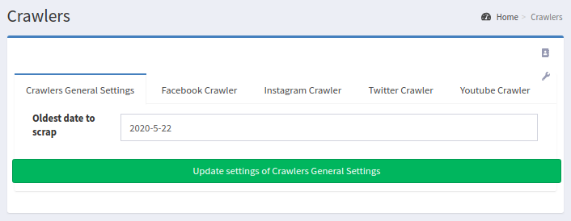
</center>

- <b>Oldest Date to Scrap:</b> la date (format yyyy/mm/dd) qui va limiter le scrapping

### Crawler Facebook

<center>
    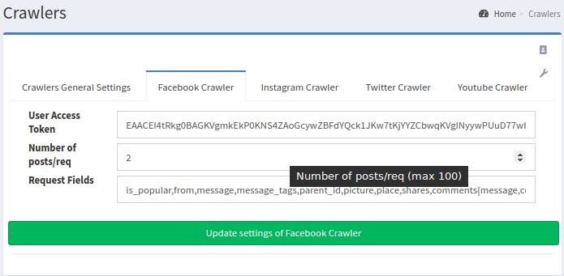
</center>

- <b>Number of posts/req :</b> nombre des articles à scrapper par requette (max : 100)
- <b>Request Fields :</b> liste des champs à inclure dans la réponse. <a href="https://developers.facebook.com/docs/graph-api/reference/page/#fields"> Liste complète des valeurs possible </a>
- <b>User Access Token: </b> Pour l'obtenir, on peut se servir de l'interface <a href="https://developers.facebook.com/tools/explorer/?method=GET&path=Vneuron&version=v5.0"> Graph Tool</a>

<center>
    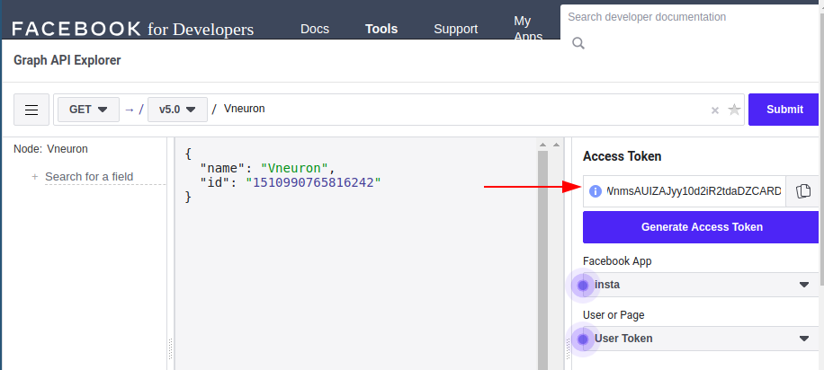
</center>

<aside class="notice">
   Il faut échanger le User Access Token par a Long Lived User Access Token (durée de vie illimité) en suivant <a href="https://developers.facebook.com/docs/facebook-login/access-tokens/refreshing/" > Ces étapes </a> 
</aside>

### Crawler Twitter

<center>
    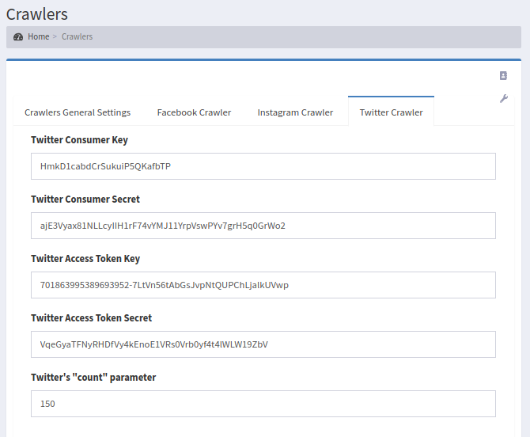
</center>

- <b>Twitter's "count" parameter</b> nombre des articles par requête (Max 200) <a href="https://developer.twitter.com/en/docs/tweets/timelines/api-reference/get-statuses-user_timeline#parameters"> documentation</a>
- <b>Access Parameters </b> Aprés la création d'une App twitter, on peut trouver tout les infos nécessaires. <a href="https://developer.twitter.com/en/apps"> Lien </a>

### Crawler Youtube

<center>
    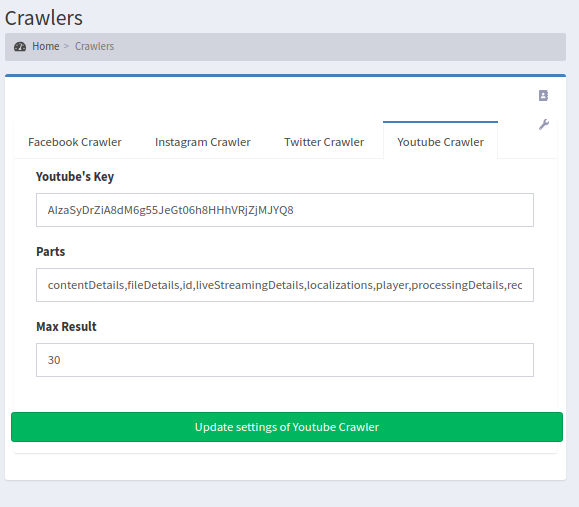
</center>

- <b>Youtube's Key :</b> Il fault creér un projet de type "Youtube Data API" sur <a href="https://console.developers.google.com/project"> la plateform Google Developers</a>
- <b>Parts :</b> List des types de données à scrapper. <a href="https://developers.google.com/youtube/v3/docs/videos/list#part" >Liste complète des valeurs possibles</a>
- <b>Max Result :</b> Nombre des articles par requête. <a href="https://developers.google.com/youtube/v3/docs/videos/list#maxResults">Documentation </a>

## Paramètres d'affichage

<center>
    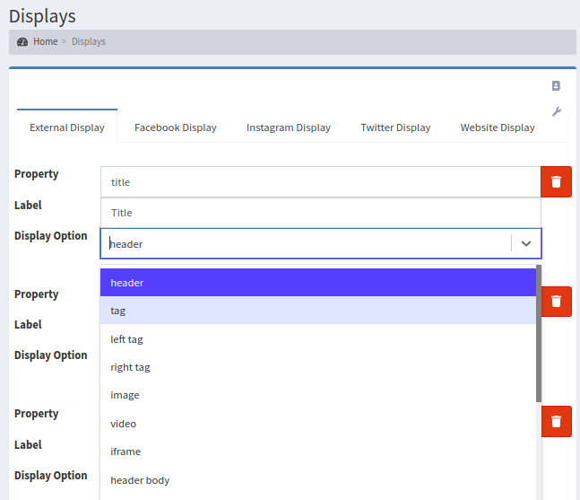
</center>

- <b>Property: </b> Nom du champ en question comme décrit dans l'interface de Parsing
- <b>Label: </b> Label utilisé dans l'affichage
- <b>Display Option: </b> les options d'affichage possible

## Paramètres additionnels

### Manager

<center>
    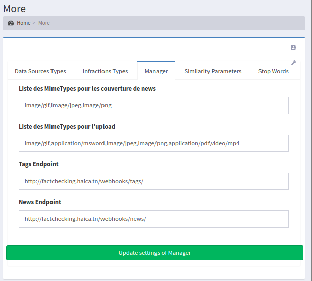
</center>

- <b>Liste des MimeTypes pour les couverture de news :</b> les mimetypes supportés pour les fichiers d'image de couverture
- <b>Liste des MimeTypes pour l'upload: </b> les mimetypes supportés pour les fichiers des preuves
- <b>Tags Endpoint :</b> Lien de API des sujets et catégories de l'extranet
- <b>News Endpoint :</b> Lien de API des news de l'extranet

### Similarity Parameters

Permet de paramétrer la fonction de similarités utilisés pour détecter les redoublants lors de l'insertion d'un nouveau News

Les paramètres et leur fonctions sont documentés dans <a href="https://www.elastic.co/guide/en/elasticsearch/reference/current/query-dsl-mlt-query.html#mlt-query-term-selection"> le lien suivant</a>
